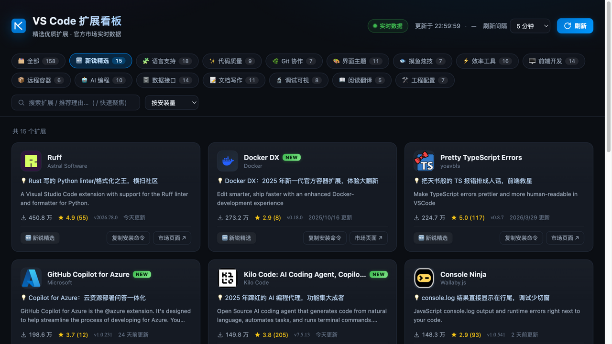

# VS Code 扩展看板

精选 **158 个**优质 VS Code 扩展的推荐看板，数据来自 Visual Studio Marketplace 官方 API **实时查询**，支持自动刷新、分类筛选、搜索与排序。

线上地址：<https://vscode.zxclaw.top>（NAS Docker + Cloudflare Tunnel）



## 快速开始

```bash
python3 server.py        # 默认端口 8137
# 打开 http://127.0.0.1:8137
```

无需安装任何依赖（仅 Python 3 标准库），无构建步骤。

## 功能

- **实时数据**：安装量、评分、版本号、更新时间均来自市场官方 API
- **自动刷新**：默认每 5 分钟刷新一次（1/3/5/10/30 分钟可选，记忆偏好），带倒计时；标签页切到后台自动暂停，回来自动补齐
- **分类筛选**：15 个分类 —— 打头的是 **🆕 新锐精选**（近两年发布且口碑出色：Docker DX、Astral ty、Kilo Code、Ruff、Console Ninja…）；实用的有语言支持、代码质量、Git 协作、界面主题、效率工具、前端开发、远程容器、AI 编程、数据接口、文档写作；不那么正经的有 **🐟 摸鱼炫技**（打字喷火的 Power Mode、盯盘神器韭菜盒子…）、**🔬 调试可视**、**📖 阅读翻译**、**🛠️ 工程配置**。点卡片上的分类标签也可快速筛选
- **NEW 徽章**：近 24 个月上架的扩展自动显示绿色 NEW 标（悬停可见上架日期）
- **🎲 惊喜三连**：点一下随机抽 3 个「不走寻常路」的宝藏扩展 —— 只从人工圈选的 46 个惊喜池里抽（打字喷火的 Power Mode、盯盘的韭菜盒子、画数据结构的 Debug Visualizer、Markdown 写 PPT 的 Slidev…），绝不出现 Python/Prettier 这类老生常谈；可无限「再掷一次」
- **搜索**：匹配名称、发布者、简介、推荐理由；按 `/` 快速聚焦
- **排序**：按安装量 / 评分 / 最近更新 / 名称
- **一键复制安装命令**：`code --install-extension <id>`
- 推荐理由为人工撰写的中文一句话点评

## 文件结构

```
index.html   页面结构
styles.css   样式（暗色主题，CSS 变量集中在 :root）
app.js       数据获取、渲染、筛选、自动刷新调度
data.js      扩展目录与分类定义（唯一需要编辑的文件）
server.py    静态服务 + API 代理
```

## 增删扩展

编辑 `data.js` 中的 `CATALOG`，一行一个：

```js
{ id: 'publisher.extension-name', cat: 'tools', note: '推荐理由' },
```

`id` 为市场唯一标识（市场页面 URL 中 `itemName=` 的部分），`cat` 取自 `CATEGORIES`。

## NAS 部署（Docker）

```bash
git clone https://github.com/XiaoZ-0218/vscode-extension-board.git
cd vscode-extension-board
docker compose up -d        # 镜像走 docker.1ms.run 加速，见 compose.yml
```

更新：`git pull && docker compose restart`。容器内以 `HOST=0.0.0.0` 监听 8137；对外经 Cloudflare Tunnel（UG NAS） ingress `vscode.zxclaw.top → http://localhost:8137`。

## 为什么需要 server.py 的代理

市场的 WAF 会拦截 User-Agent 含 `Electron` 等字样的请求（返回 403 "User agent is blocked"）。代理会为请求换上常规浏览器 UA，同时让页面同源调用、无需关心跨域。若用纯静态服务器托管（无 `/api` 代理），前端会自动回退为浏览器直连市场 API——在常规浏览器中同样可以工作。
